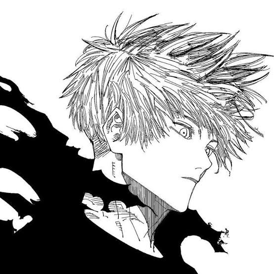
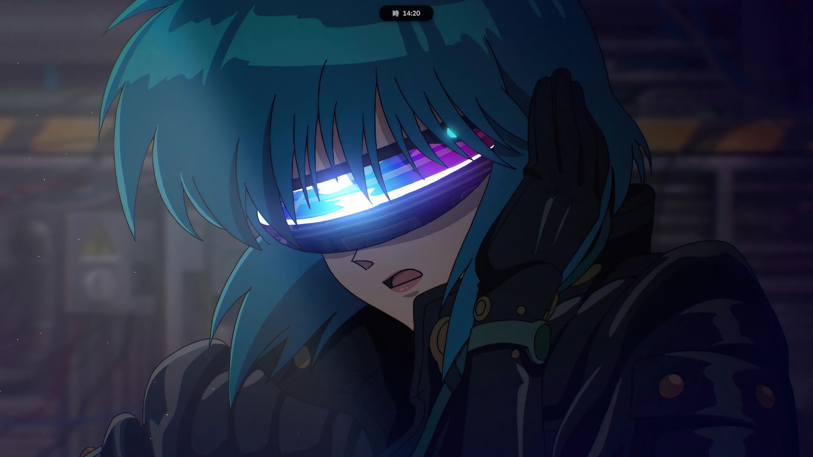
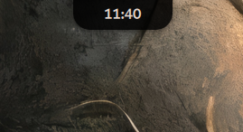
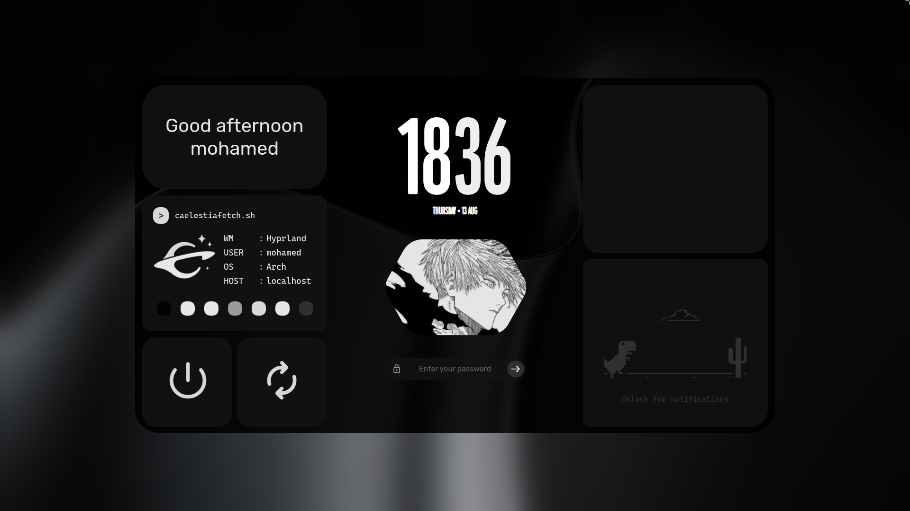

# 🪐 My-Linux-Dots

<p align="center">
  
</p>

<p align="center">
  <strong>Mi Setup definitivo Minimalista en Cachyos</strong><br>
  Basado en la suite de personalización <code>RICELIN</code> (Quickshell) con Isla Dinámica para Hyprland.
</p>

---

> [!IMPORTANT]
> Este setup ha sido desarrollado y probado **exclusivamente en CachyOS**. Debido a las optimizaciones nativas de rendimiento, dependencias de Qt6 y scripts modulares de Lua usados aquí, **no se garantiza en absoluto que funcione en otras distribuciones que no estén basadas en Arch Linux**. Úsalo bajo tu propio riesgo en otros entornos.

---

##  Instalación Automatica

Para clonar este entorno de forma idéntica en un sistema limpio de **CachyOS**, debes ejecutar este unico comando dentro de tu terminal **Fish**.

```bash
git clone https://github.com/exiro66/My-Linux-Dots.git && cd My-Linux-Dots && fish install.fish
```

---


##  Capturas de Pantalla del Setup

Aquí puedes ver cómo luce el sistema en acción tras completar la instalación automática:








---

## Comandos Especiales Incluidos

Este repositorio inyecta funciones nativas muy potentes en tu shell Fish para gestionar el sistema con palabras clave ultra cortas desde tu consola:

###  Selector de Estilos Visuales para el Login (`sddm.fish`)
* `sddm black` ➔ Estilo Monocromático Blanco y Negro Puro con transparencias limpias.
* `sddm red` | `sddm blue` | `sddm green` | `sddm purple` | `sddm beige` | `sddm orange` | `sddm pink` | `sddm white` | `sddm yellow`
* `sddm (color) --no-restart` ➔ Cambiar Estilo sin Reiniciar

###  Personalización Temática de Iconos (`icons.fish`)
* `icons grey` ➔ Cambia todas las carpetas del sistema a un tono Gris Plomo elegante.
* Soporte total para toda la paleta: `red`, `carmine`, `blue`, `green`, `palebrown`, `violet`, `black`, `white`, `yellow`, `orange`, `pink`, `cyan`, `magenta`, `indigo`, `brown`.
---

##  Apps Instaladas Automáticamente

El instalador incluye estas aplicaciones:

* **Zen Browser** ➔ Navegador moderno con transparencias.
* **Ghostty** ➔ Terminal rápida con GPU.
* **Loupe** ➔ Visor de imágenes.
* **Nautilus** ➔ Gestor de archivos.
* **qBittorrent** ➔ Cliente de torrents.
* **Lutris** ➔ Gestor de juegos.
* **Wine + Winetricks** ➔ Compatibilidad con apps de Windows.
* **GNOME Calculator** ➔ Calculadora.
* **GNOME Disk Utility** ➔ Gestor de discos.
* **ZapZap** ➔ WhatsApp no oficial (Flatpak).

También se eliminan automáticamente **Firefox** y **Alacritty** (vienen con CachyOS pero no se usan).

## Atajos del Sistema Añadidos

* **`Alt + Shift`** ➔ Conmuta de forma nativa e instantánea la distribución del teclado entre **Inglés (US)** y **Español (ES)**, configurado directamente sobre el módulo `input.lua` de Hyprland.
* **Transparencia Activa** ➔ Todo el renderizado gráfico de efectos visuales pesados (*blur*) ha sido desactivado en favor de transparencias alfa puras. Esto duplica el rendimiento en memoria *Single-Channel* y GPUs integradas de laptops, manteniendo una estética cyberpunk de alta gama.

###  Lista Completa de Atajos (Keybinds)

El modificador principal (`SUPER`) es la tecla de Windows.

| Atajo | Acción / Comando |
| :--- | :--- |
| `SUPER + T` | Abrir la terminal **Ghostty** |
| `SUPER + B` | Abrir el navegador **Zen Browser** |
| `SUPER + E` | Abrir el gestor de archivos **Nautilus** |
| `SUPER + Q` | Cerrar la ventana activa |
| `SUPER + SHIFT + Q` | Forzar el cierre (*kill*) de la ventana |
| `SUPER + F` | Alternar pantalla completa (*fullscreen*) |
| `SUPER + SHIFT + T` | Alternar ventana flotante |
| `SUPER + A` | Abrir el lanzador de aplicaciones (*Launcher*) |
| `SUPER + V` | Abrir el historial del portapapeles (*Clipboard*) |
| `SUPER + L` | Bloquear la pantalla (*Lock screen*) |
| `SUPER + W` | Abrir el selector gráfico de fondos de pantalla |
| `SUPER + SHIFT + W` | Cambiar de fondo de pantalla aleatoriamente |
| `SUPER + S` | Hacer captura de pantalla con **Rishot** (Herramienta de recorte) |
| `SUPER + SHIFT + S` | Hacer captura de pantalla completa del monitor con **Rishot** |
| `SUPER + M` | Minimizar la ventana actual (Script dedicado) |
| `SUPER + SHIFT + M` | Mostrar / ocultar el contenedor especial de ventanas minimizadas |
| `SUPER + R` | Iniciar / detener grabación de pantalla (Script dedicado) |
| `SUPER + G` | Alternar el modo de juego (*Game Mode*) |
| `SUPER + D` | Cambiar el sistema global de GTK a **Modo Oscuro** (*prefer-dark*) |
| `SUPER + C` | Cambiar el sistema global de GTK a **Modo Claro** (*prefer-light*) |
| `SUPER + [1 - 0]` | Cambiar al espacio de trabajo (*Workspace*) del 1 al 10 |
| `SUPER + SHIFT + [1 - 0]` | Mover la ventana activa al espacio de trabajo asignado (sin seguirla) |
| `SUPER + Flecha Izquierda` | Cambiar al espacio de trabajo anterior (`r-1`) |
| `SUPER + Flecha Derecha` | Cambiar al espacio de trabajo siguiente (`r+1`) |
| `SUPER + Rueda Arriba` | Cambiar al espacio de trabajo anterior con el ratón |
| `SUPER + Rueda Abajo` | Cambiar al espacio de trabajo siguiente con el ratón |
| `SUPER + Clic Izquierdo` | Arrastrar y mover ventanas flotantes |
| `SUPER + Clic Derecho` | Redimensionar el tamaño de las ventanas flotantes |

###  Teclas Multimedia y Control de Brillo
* `Volumen + / -` ➔ Sube o baja el audio del sistema en intervalos de 5% mediante `wpctl`.
* `Silencio` ➔ Alterna el estado de mute de tu salida de audio.
* `Brillo + / -` ➔ Sube o baja la iluminación de la pantalla de tu portátil mediante `brightnessctl`.
* `Play / Next / Prev` ➔ Control total del reproductor multimedia enlazado a la barra de Ricelin.

---

##  Guía: Cómo crear tu propio estilo personalizado de SDDM (Wallpaper + Avatar + Colores)

El script `sddm` es completamente dinámico. Si quieres añadir un color nuevo creado por ti (por ejemplo, un modo `cyberpunk` o `anime`), solo debes seguir estos pasos:

### Paso 1: Preparar tus imágenes locales
1. Ve a tu carpeta `~/SDDM/`.
2. Crea una nueva carpeta con el nombre de tu estilo en **MAYÚSCULAS** (por ejemplo: `CYBERPUNK`).
3. Mete tus dos imágenes dentro con estos nombres exactos:
   * **`A.jpg`** ➔ Será tu Fondo de Pantalla (Wallpaper).
   * **`B.jpg`** ➔ Será tu Foto de Perfil (Avatar).

### Paso 2: Registrar tu paleta de colores en el script
Para que la interfaz de login combine con tus fotos, abre tu script con:
```bash
nano ~/.config/fish/functions/sddm.fish
```
Baja hasta el final del bloque de casos (`switch`) y añade tu nuevo modo justo antes de la línea `end`:

```fish
        case CYBERPUNK
            echo "Aplicando paleta Cyberpunk personalizada..."
            sudo sed -i 's/^background=.*/background=#0d021a/' /usr/share/sddm/themes/caelestia/theme.conf
            sudo sed -i 's/^mainCard=.*/mainCard=#190533/' /usr/share/sddm/themes/caelestia/theme.conf
            sudo sed -i 's/^subComponents=.*/subComponents=#2b0a54/' /usr/share/sddm/themes/caelestia/theme.conf
            sudo sed -i 's/^text=.*/text=#00ffff/' /usr/share/sddm/themes/caelestia/theme.conf
            sudo sed -i 's/^textDark=.*/textDark=#ff007f/' /usr/share/sddm/themes/caelestia/theme.conf
            sudo sed -i 's/^primary=.*/primary=#ffff00/' /usr/share/sddm/themes/caelestia/theme.conf
            sudo sed -i 's/^onPrimary=.*/onPrimary=#000000/' /usr/share/sddm/themes/caelestia/theme.conf
```
*(Tip: Puedes cambiar los códigos `#HEX` para personalizar el fondo de las tarjetas, los botones y los textos a tu gusto).*

### Paso 3: Aplicar tu creación
¡Listo! Abre tu terminal y ejecuta tu nuevo comando de forma directa:
```bash
sddm cyberpunk
```
El script se encargará solo de mover tus imágenes a las carpetas del sistema, corregir los permisos y configurar tu nueva paleta hexadecimal al instante.

---

##  Cómo Mostrar Limine de Nuevo

Si quieres volver a ver el menú de Limine al arrancar:

1. Abre la configuración:

```bash
sudo nano /boot/limine.conf
```
2. Cambia estos valores:

```bash
timeout: 5
quiet: no
```

3. Guarda con Ctrl + S y sal con Ctrl + X.

4. Reinicia para ver el cambio.

##  Cómo Cambiar el Tema de Plymouth

Para cambiar el tema de arranque de Plymouth:

1. Ver los temas disponibles:
```bash
ls /usr/share/plymouth/themes/
```

2. Cambiar al tema que quieras:
```bash
sudo plymouth-set-default-theme -R nombre-del-tema
```

---

##  Créditos y Agradecimientos

Este repositorio recopila y personaliza profundamente el trabajo de dos proyectos de la comunidad para el ecosistema de Hyprland:

- **Pantalla de Inicio de Sesión (SDDM):** [Caelestia SDDM por ItsABigIgloo](https://github.com/ItsABigIgloo/caelestia-sddm/tree/main) - Creador original del tema de login Locklike, modificado aquí para remover el blur en favor de transparencias monocromáticas de alto rendimiento.

- **Entorno de Escritorio y Barra:** [Ricelin por Gakuseei](https://github.com/Gakuseei/Ricelin) - Desarrollador de la interfaz basada en la píldora (Dynamic Island) y la estructura base de la shell de comandos.

Muchas gracias a ambos autores por su excelente trabajo.

---

##  Licencia

Este proyecto es personal y de uso libre. Si utilizas partes de este setup, agradecería una mención o estrella en el repositorio.

---

Hecho con 💙 por [exiro66](https://github.com/exiro66)
