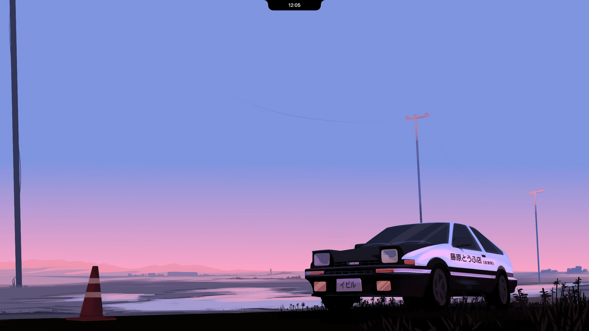
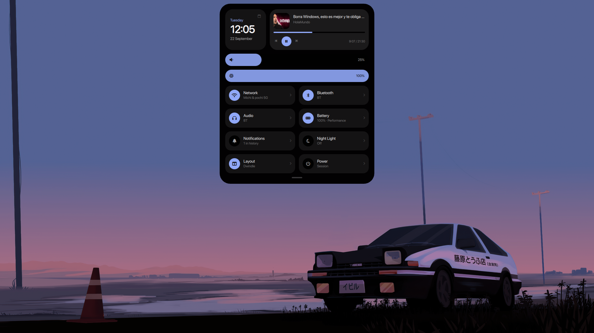
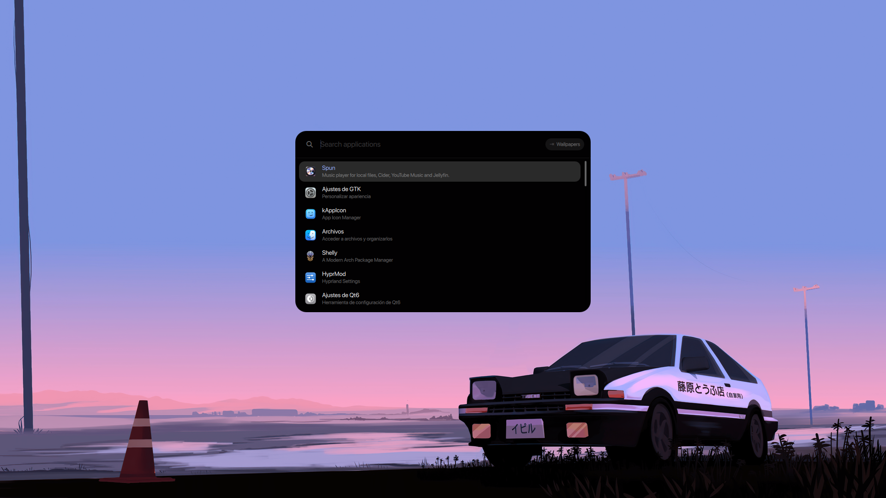
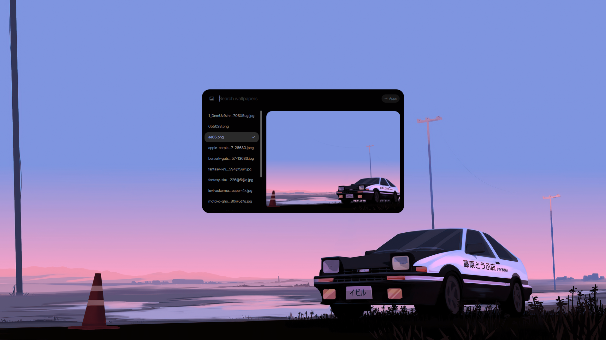
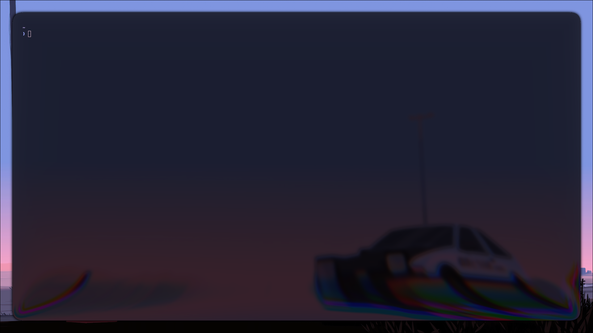
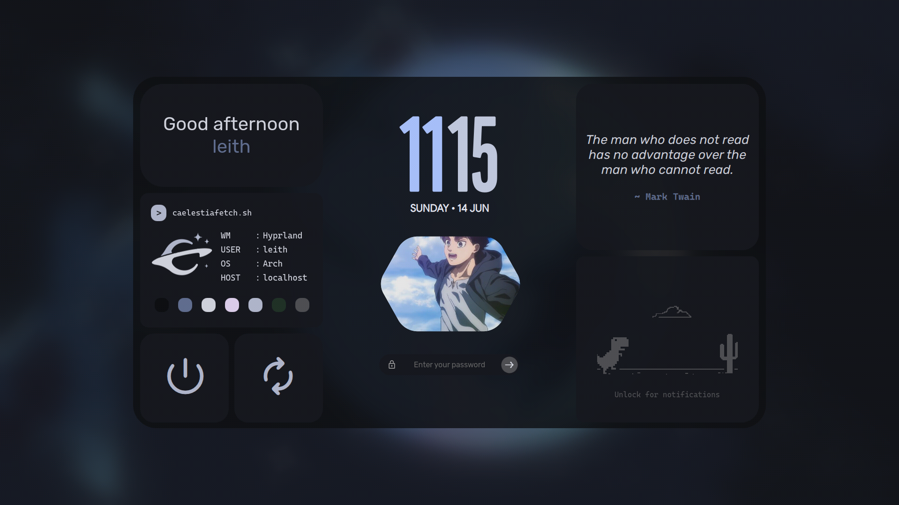
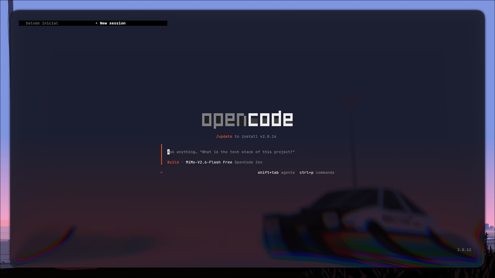

# My Linux Dots — Hyprland + NotchShell

Escritorio Hyprland con notch estilo Dynamic Island, temas automáticos con
pywal y atajos en Lua. Probado en CachyOS, sirve en cualquier Arch.









## Qué incluye

* **Notch** (basado en [NotchShell](https://github.com/selvarn/NotchShell),
  con parches propios): reloj, centro de comandos, launchers de apps y
  fondos, notificaciones en el notch, Bluetooth, batería + perfiles
  (balanced/performance/power-saver), layouts (dwindle/master/scrollable/monocle),
  brillo, workspaces por monitor, todo en un monitor a la vez.
* **Temas automáticos**: al cambiar de fondo, pywal retiñe terminal, GTK/Qt,
  bordes de Hyprland, starship y el propio notch.
* **Hyprland en Lua**: binds, autostart, decoraciones, workspaces `r~N`
  (numeración independiente por monitor).
* **Scripts**: `wal-apply-all.fish`, `notch-reload.sh`, `notch-quickshell.sh`.
* **SDDM**: tema caelestia + packs de fondos.
* **Kitty** con tema generado por pywal.

## Instalación

```fish
git clone https://github.com/exiro66/My-Linux-Dots.git
cd My-Linux-Dots
fish install.fish
```

El instalador pide sudo, hace respaldo de tu `~/.config`, instala paquetes
de Arch + AUR, copia configs, deja SDDM listo y genera el primer tema.
Después cierra sesión y entra en Hyprland.

Notas:

* La fuente del notch es **SF Pro** (Apple, no se puede subir al repo):
  el instalador pone `otf-apple-sf-pro` del AUR. Sin ella cae a la fuente
  del sistema. Iconos MacTahoe y cursor Bibata también van por AUR.
* Sin `brightnessctl` no sale la barra de brillo; sin `bluez`, el tile
  Bluetooth se oculta solo. Todo degrada sin romper.

## Atajos principales

| Teclas | Acción |
| --- | --- |
| SUPER + A | Lanzador de apps |
| SUPER + C | Command Center / toggle notch |
| SUPER + W | Selector de fondos |
| SUPER + R | Recargar Quickshell + Hyprland |
| SUPER + T | Terminal (kitty) |
| SUPER + B | Navegador (Zen) |
| SUPER + E | Gestor de archivos (Nautilus) |
| SUPER + G | Grabar pantalla (Kooha) |
| SUPER + S | Captura de región + anotar (Satty) |
| SUPER + SHIFT + S | Captura de monitor + anotar (Satty) |
| SUPER + L | Bloquear pantalla |
| SUPER + Tab | Overview |
| SUPER + 1..0 | Workspaces del monitor actual |
| SUPER + SHIFT + 1..0 | Mover ventana al workspace |
| SUPER + Space | Cambiar layout (dwindle/master/scrolling/monocle) |
| SUPER + Q | Cerrar ventana |
| SUPER + SHIFT + Q | Matar ventana |
| SUPER + SHIFT + T | Alternar flotante |
| SUPER + F | Pantalla completa |
| SUPER + ← / → / ↑ / ↓ | Mover foco entre ventanas |
| SUPER + scroll | Mover foco |
| SUPER + LMB | Arrastrar ventana |
| SUPER + RMB | Redimensionar ventana |
| SUPER + SHIFT + ← | Workspace anterior |
| SUPER + SHIFT + → | Workspace siguiente |
| SUPER + N | Fijar notch visible / auto-ocultar |
| SUPER + SHIFT + N | Notch en todas las pantallas / 1 pantalla |

## Multimedia (teclas físicas)

| Tecla | Acción |
| --- | --- |
| XF86AudioRaiseVolume | Subir volumen 5% |
| XF86AudioLowerVolume | Bajar volumen 5% |
| XF86AudioMute | Silenciar |
| XF86MonBrightnessUp | Subir brillo 5% |
| XF86MonBrightnessDown | Bajar brillo 5% |
| XF86AudioPlay / XF86AudioPause | Reproducir / pausar |
| XF86AudioNext | Siguiente pista |
| XF86AudioPrev | Pista anterior |

## Estructura

```
hypr/        config de Hyprland (Lua)
kitty/       terminal + tema pywal
quickshell/  NotchShell + parches (ver abajo)
scripts/     wal-apply-all, notch-reload, notch-quickshell
sddm/        conf + tema caelestia + packs de fondos
Wallpapers/  fondos
Assets/      capturas del README
install.fish instalador
```

## Parches sobre NotchShell upstream

`quickshell/` parte de `selvarn/NotchShell` sin `.git`, con: centro en un
solo monitor, notificaciones nativas (sin dunst), Bluetooth, batería +
perfiles, layouts, brillo, workspaces por posición `r~N`, fuente directa
SF Pro Rounded, MSAA en la curva y ServerNotif→historial propio.
